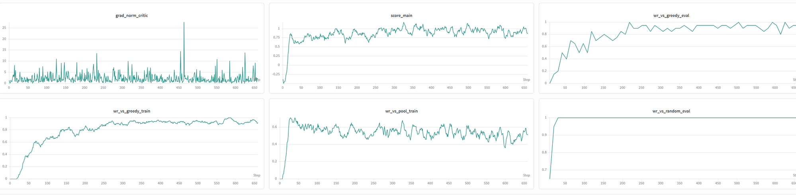
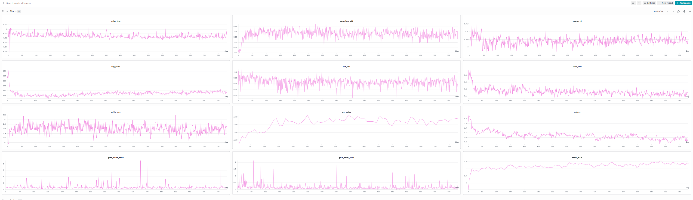
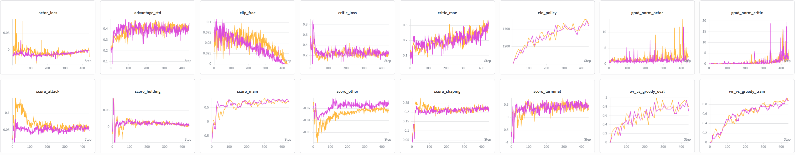

# Experiment Log

Chronological record of training runs — what changed, when, and what the metrics showed.

---

## 2026-05-28 — Reward redesign + PPO fixes (run: solar-sun-127)

**Changes:** Removed `MOVE_ON_BASE_REWARD` / `MOVE_NEAR_BASE_REWARD` (created a neutral-over-enemy bias) and added a per-turn holding reward (`holding_reward_rate = 0.0016`) to break the base-flip exploit. Also applied PPO fixes: epochs 1→4, value-loss clipping (C5), normalised global features (C2), snapshot_every 1→3 (C3).

**Results:** `critic_mae` and `wr_vs_greedy_eval` remained at similar levels to the previous run (max ~33%). The main visible improvement was `avg_turns` dropping from ~80–140 to ~40–80, indicating the policy now ends games decisively rather than stalling — a sign the holding reward is working as intended.

---

## 2026-05-28 — Board mirroring for P2 perspective (run: lively-pyramid-129)

**Changes:** Implemented C6 fix — when `active_player == 2` the observation is rotated 180° so the policy always sees its own units at the top-left of the board. Unit coordinates remapped `(r,c) → (6-r, 6-c)`, action mask remapped with self-inverse offset flip `[3,4,5,0,1,2]`, and all action IDs reverse-mapped before `env.step()` in both the training loop and evaluator.

**Results:** `wr_vs_greedy_eval` peaked at **49%** vs **33%** maximum in the previous run — a clear step change driven by the policy now learning a single unified strategy instead of two mirrored ones. `wr_vs_random_eval` remained stable at ~1.0 throughout. `wr_vs_greedy_train` shows a consistent upward trend across the full 300 batches, and `score_main` is trending up vs the previous run's oscillation. The 60% WR target is not yet reached but the trajectory is positive.

---

## 2026-05-29 — Hex-correct board encoder (C13)

**Changes:** Implemented C13 fix — replaced the 2D 3×3 convolutions in `Policy.board_encoder` and `Critic.board_encoder` with `HexConv2d`, a custom module that gathers only the 6 hex neighbours plus center via `F.unfold` and projects with a 1×1 conv. The two anti-diagonal positions that are not hex-adjacent under `Board.offsets` are excluded from the kernel. See `docs/decision.md` for the full rationale.

**Results:** `wr_vs_greedy_eval` climbed steadily through training, crossing **60% by ~step 300** and peaking at **80% around step 360 and again around step 580** over a ~650-batch run. From step ~300 onward the curve oscillates in the 0.4–0.8 range — variance is high (`eval_episodes=20` → std error ≈ 11pp on a 0.6 estimate) but the mean is clearly above the 60% target. This is the first run where the agent meaningfully exceeds greedy on the current rule set; the goal stated at the top of `improvement_ideas.md` is met.

**Implication.** The prototype rule set (2 units, move-only, claim bases) is now solved well enough that further encoder / hyperparameter tuning would be optimising against a saturated target. Next focus shifts to expanding the rule set toward the original game — see `docs/decision.md` § *2026-05-29 — Focus shift: expand rule set toward original Warchest*.

---

## 2026-05-30 — Attack + deploy actions, spatial conv head (run: ~step 270)

**Changes:** Added two new action types (`attack`: instant-kill adjacent enemy unit; `deploy`: place a new unit on a controlled empty base, capped at `MAX_DEPLOYS=4` lifetime uses). Simultaneously migrated the policy to a spatial cell-keyed action head: the board encoder now outputs a `[Cf, 7, 7]` feature map (no flatten), unit positions moved into board planes (channels 6–7), the separate `unit_encoder` MLP was removed (planes-only), and the actor head became a `Conv2d → [14, 7, 7]` logit map (`action_dim = 14×49 = 686`). P2 rotation now applies uniformly to the full spatial grid (no per-action-type remapping tables needed). Global features expanded from 3 → 5 dims to expose remaining deploy budgets to both policy and critic. GreedyBot rewritten with priority attack → control → move. See `docs/decision.md` § *2026-05-30* for the full rationale.

**Results:** `wr_vs_greedy_train` climbed from near 0 to **~90% by step ~270**, well above the 80% peak of the previous run on the move-only game. The curve shows a consistent upward trend with no regression — the richer action set (attack pressure, deploy recovery) and the spatially-coherent head appear to make the learning problem structurally easier for the agent, not harder. Attack and deploy actions are both used by the trained policy.

---

## 2026-05-31 — Full coin economy (Phase 1c), ~650 batches

**Changes:** First training run on the complete Phase 1 coin/bag economy (Phase 1a→1c). The env is now faithful two-unit-type War Chest: a per-player **bag** (2 Swordsman + 2 Knight + 1 Royal) with a random 3-coin draw each round, discard + reshuffle; **round/turn controller** with initiative (randomised at setup, claim-initiative transfers it ≤ once/round); coins **bind to the board** (deploy moves a coin hand→board; **coin-stack HP** via bolster; attack removes one coin to the box); **recruit** from a per-type supply; **pass**. Action space is the temporary flat head, now `796` (spatial `16×49` incl. deploy-S/K + bolster, plus 12 face-down slots for claim/pass/recruit). Observation `OBS_VERSION=3`, `GLOBAL_DIM=28`: ego-centric coin-counting features (own hand/bag/discard/supply known; opponent on-board/face-up-discard/supply + derived `hidden_pool`), unit planes carry stack height. **Privileged critic** wired (`PRIV_DIM=9` — opponent's true hidden hand/bag/face-down split, never seen by the policy).

**Results:** Strong, healthy convergence over ~650 batches.
- `wr_vs_greedy_eval` rises to **~0.9** and holds there from ~step 220 onward (peaks near 1.0); `wr_vs_greedy_train` tracks it at **~0.9**.
- `wr_vs_random_eval` saturates at **1.0** within ~20 steps and stays flat.
- `wr_vs_pool_train` (self-play vs the opponent-pool snapshots) sits at **~0.5**, oscillating 0.4–0.6 — the expected equilibrium for self-play and a sign the pool is keeping pace.
- `score_main` plateaus around **0.9–1.0**; `grad_norm_critic` stays low (~2–5) with only occasional spikes (≤27) — stable value learning, no divergence.

The full coin economy is learnable end-to-end: the agent masters the much larger action/observation space and beats greedy at the same ~90% it reached on the far simpler move+attack+deploy prototype, while self-play stays balanced.

**Caveats.** (1) `GreedyBot` ignores bolster and recruit, so "WR vs greedy" is a softer bar than full-economy play — the agent is beating an economy-blind, myopic bot. (2) The privileged critic is in use but **not yet A/B'd** against a public-only critic, so its contribution to this result is unmeasured. Both are open items before reading too much into the 90%.

---

## 2026-06-30 — Full base game, long run (run: `ppo_20260630-060400`, ~710/1000 batches)

**Changes:** First long training run on the **complete base game** — all 16 units with their
tactics/attributes/restrictions and per-game disjoint drafting (`OBS_VERSION=8`,
`ACTION_SPACE_SIZE=1875`). This is the culmination of Phases 3–4. Hyperparameters:
`collect_episodes=64, ppo_epochs=4, ppo_eps=0.2, gamma=0.99, lam=0.95, entropy_coeff=0.025,
lr_actor=lr_critic=3e-4, hidden_dim=64, minibatch=64`; opponent schedule `random/greedy/pool`
`0.4/0.2/0.4` → `0/0.4/0.6` (finetune triggered almost immediately once `wr_random` hit 1.0).
`GreedyBot.RANDOM_ACTION_PROB=0.0`, so greedy eval is now the **true** bot (idea C9 resolved) —
this WR is honest, not softened.

**Results:** the agent learns the full ruleset and beats greedy, but **plateaus early and then
oscillates for ~10 h with no real gain**. Reading the panels (see image):

- **`elo_policy`** ramps ~1050 → ~1400 by batch ~130–250, then oscillates 1350–1420 flat for
  the entire second half (peaks 1426 at batches 230/360, never beaten). `wr_greedy` (not in this
  panel set) mirrors it: ~0.72 mean, no trend; `wr_random` ≈ 1.0 throughout.
- **`entropy`** falls only 1.75 → ~1.25 and stalls — that's ~70% of the *measured* max entropy
  (mean legal-action count is just 7.8, so max ≈ 1.84). The policy never commits; it keeps
  spreading mass over ~half the legal moves.
- **`score_main`** keeps climbing (~0.9 → ~1.4–1.5) across the whole run **while WR/Elo stay
  flat** — the agent is optimizing the dense shaping signal, not wins. `avg_turns` sits flat
  ~125–140 (the analysis log notes a mild 127→150 drift), i.e. games aren't getting more
  decisive as score rises. This score-vs-win decoupling is the headline problem.
- **Training-health signals are all clean:** `critic_loss` drops ~0.5 → ~0.12 and stays low;
  `critic_mae` flat ~0.05–0.07; `approx_kl` ~0.005; `clip_frac` steady ~0.06–0.08;
  `advantage_std` stable ~0.3; `actor_loss` ~0; grad norms low with only occasional spikes
  (actor ≤8, critic ≤3). Nothing is diverging — this is **not** an optimization-instability or
  train-longer problem.

**Takeaway.** The full game is learnable end-to-end and the agent reaches ~70% vs true greedy,
but the last ~580 batches (~10 h) bought nothing. Root cause is **reward design + exploration
pressure**, not compute or stability. This diagnosis drove the entropy/LR annealing, sparser
pool snapshots, `ATTACK_REWARD` cut, critic widening, and material-PBRS fixes recorded in
`docs/history.md`. (`docs/METRICS.md`'s entropy band has since been recalibrated to the
current max ≈ 1.84.)

---

## 2026-07-02 — Threat/position-aware observation + deeper trunk (run: `ppo_20260702-082214`)

*Design/implementation: `docs/history.md` → "Threat/position-aware observation + deeper trunk".*

**Changes:** Implemented the `docs/IDEAS.md` "the agent can't see the board as one position" note in full: 6 graded threat/reach planes (`own`/`enemy` × `melee`/`ranged`/`charge`, with an exact Berserker closed-form and Marshall grant-chaining), 2 static ego-centric coordinate planes, a flank-split pool feeding `verb_head`/`facedown_head` in place of the old location-blind global mean, and a 3rd `HexConv2d` trunk layer (receptive field radius 2→3). `BOARD_CHANNELS` 38→46, `OBS_VERSION` 8→9 — schema-breaking, fresh run. Same hyperparameters and **same `n_batches=400`** as the correct pre-change baseline, run `ppo_20260701-191923` (`collect_episodes=64, ppo_epochs=4, gamma=0.99, lam=0.95, entropy_coeff=0.025→0.003, lr=3e-4, hidden_dim=64`) — a genuinely equal-length comparison.

**Note on an earlier version of this entry:** the first two drafts compared against `ppo_20260630-060400` (`n_batches=1000`, manually interrupted at batch 711) — the wrong run, with unequal length, that happened to be the most recently-documented baseline in this file. The correct comparison is against `ppo_20260701-191923` (wandb `f3oyn0sb`), the run actually shown alongside this one in the panel image below, which used the identical `n_batches=400` schedule. All numbers below use the correct run.

**Results — headline: no measurable difference.** The W&B panel image overlays both runs: **orange = this new run (`ppo_20260702-082214`)**, **magenta = the correct baseline (`ppo_20260701-191923`)**. The two final `wandb` summaries:

| Metric | Baseline (`f3oyn0sb`) | This run (`u62wwlnc`) |
|---|---|---|
| `wr_vs_greedy_train` | 0.880 | 0.890 |
| `wr_vs_greedy_eval` | 0.700 | 0.800 |
| `elo_policy` | 1433 | 1457 |
| `entropy` (raw) | 0.632 | 0.508 |
| `entropy_frac` | 0.256 | 0.195 |
| `critic_mae` | 0.341 | 0.312 |
| `avg_turns` | 72.8 | 60.7 |
| `score_main` | 0.708 | 0.708 |

`score_main` is identical to three decimal places; `critic_mae` and `avg_turns` are in the same range either way. Comparing the full **distribution** of the two metrics with the widest apparent gap, over each run's eval checkpoints from batch 200 on (not just the two final numbers):

| Metric | New run: mean ± std (n=21) | Baseline: mean ± std (n=18) | Gap in pooled std |
|---|---|---|---|
| `wr_vs_greedy_eval` | 0.783 ± 0.143 | 0.747 ± 0.092 | **0.31σ** — noise |
| `elo_policy` | 1410 ± 62 | 1396 ± 37 | **0.29σ** — noise |

A ~0.3 pooled-std gap, from a single run per architecture, is indistinguishable from noise. **These two runs play about the same.** This matches what the panel image shows directly — the two curves track each other closely across every panel, not just on average. Retracting both earlier drafts' framings in full: neither "every number favors the new run" nor even the more hedged "weak, and n=1" reading survive comparison against the correct baseline — the previous drafts' entire premise (that there was a gap worth explaining away) was built on the wrong reference run.

**Attribution caveat.** Moot given no measurable effect either way, but worth remembering if a future run does show one: three sub-changes (threat/reach planes, coordinate planes + split pooling, deeper trunk) shipped together in one pass rather than being A/B'd separately as the originating note suggested, so a future confirmed gain still couldn't be attributed to a specific piece without an ablation.

**Implication.** This run provides no evidence the architecture change helped or hurt. The entropy/critic numbers hint the new network isn't obviously worse, but nothing here clears the noise bar. To actually test the hypothesis: 2–3 seeds per architecture, same `n_batches`, comparing distributions (as above) rather than single runs or endpoints.

